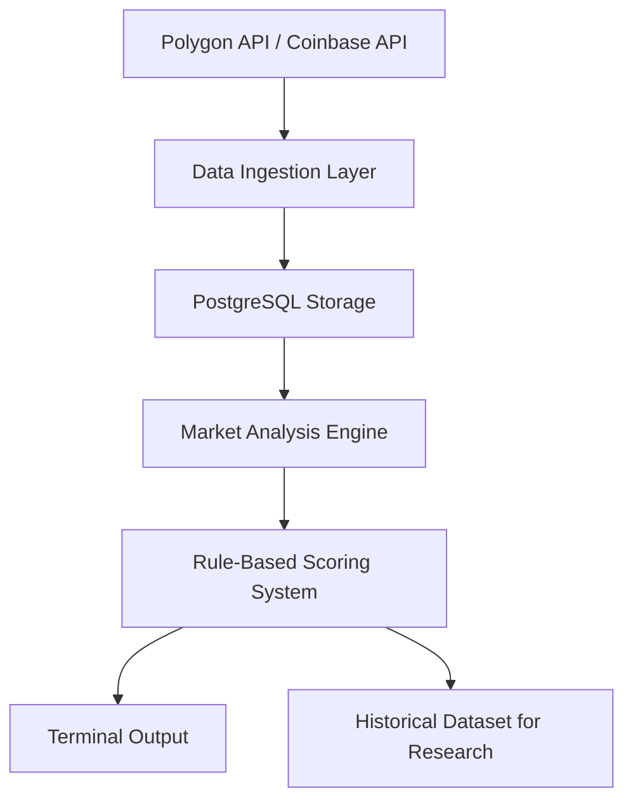

# Market Scanner

A rule-based market research system that ingests financial market data, analyzes price structure, and scores potential setups based on market context and volatility conditions. The system is designed to help identify market states worth monitoring by combining structured data pipelines with explainable analytical logic.

The platform emphasizes signal quality, contextual awareness, and disciplined analysis rather than automated trading or prediction.

# Problem

Financial markets generate continuous streams of price data across many assets and timeframes. Monitoring these markets manually makes it difficult to consistently identify meaningful structural patterns such as emerging trends, consolidation phases, or volatility shifts.

Without a structured system, analysis often becomes reactive and subjective.

A reliable research workflow requires automated data ingestion, consistent analysis rules, and persistent storage so that potential setups can be evaluated objectively over time.

# Solution

Market Scanner provides a lightweight research platform that automates the collection and analysis of market data from multiple sources. The system ingests price data, computes structural indicators, evaluates rule-based criteria, and assigns a confidence score representing the quality of a potential setup.

Rather than generating trade signals, the scanner highlights market conditions that may warrant attention. All results are stored in a database, allowing historical analysis and future evaluation of how different setups perform.

The system is intentionally human-in-the-loop: it provides context and structured observations while leaving decision-making to the user.

# System Architecture

The platform follows a simple data pipeline architecture designed for reliability and repeatability.

## System Architecture



## Data Ingestion Layer

Market data is collected from external APIs and normalized into a consistent candle format.

## Data Storage

Price data and analysis results are stored in PostgreSQL, enabling historical analysis and persistent research datasets.

## Analysis Engine

The system evaluates price structure using indicators such as trend direction, volatility context, consolidation detection, and volume behavior.

## Scoring Engine

Each potential setup is assigned a confidence score based on predefined rules that measure signal quality and market clarity.

## Output Layer

Scan results are printed to the terminal and stored in the database, making them available for later evaluation or integration into dashboards or alerts.

# Pipeline Workflow

1. Retrieve market data from Polygon (stocks) and Coinbase (crypto)
2. Normalize and store price candles in PostgreSQL
3. Compute market features including ATR, volatility regime, and volume context
4. Detect structural patterns such as trend shifts and consolidation
5. Score potential setups using rule-based confidence logic
6. Store analysis results for historical evaluation

# What the System Analyzes

For each symbol and timeframe, the scanner evaluates several aspects of market structure:
- Trend direction (up, down, sideways)
- Volatility regime (quiet, normal, active)
- Pause or consolidation detection
- Volume confirmation
- ATR (Average True Range) for reference risk sizing
- Price snapshot at the time of detection

These factors contribute to a confidence score used to rank the quality of the setup.

# Confidence Scoring

Each setup is assigned a confidence score ranging from 0 to 10.

The score reflects rule-based evaluations of:
- Trend clarity
- Consolidation quality
- Volatility context
- Volume confirmation

Scores intentionally remain capped to prevent false precision and maintain interpretability.

#Status Labels

The scanner converts confidence scores into simple attention levels.

| Status              | Meaning                             |
| ------------------- | ----------------------------------- |
| Low Priority        | Market noise or unclear structure   |
| Getting Interesting | Market conditions worth monitoring  |
| This Is Important   | High-quality setup requiring review |

These labels represent research attention levels, not trading instructions.

# Research Universe

The system analyzes a small, controlled universe of assets to maintain clean and interpretable data.

**Stocks**
- SPY — market regime proxy
- AAPL
- MSFT

**Crypto**
- BTC/USD — primary market driver
- ETH/USD
- SOL/USD — risk-on indicator

The universe can be expanded as additional filters and research methods are introduced.

# Technology Stack

**Data Processing**
- Python
- Pandas
- SQLAlchemy

**Data Infrastructure**
- PostgreSQL
- Docker / Docker Compose

**Data Sourcs**
- Polygon.io (equities)
- Coinbase API (crypto markets)

**Scheduling**
- Cron-based pipeline execution

# Project Structure

```
src/
  scanner/
    analysis/        # market structure logic
    features/        # indicators (ATR, volume, pauses)
    ingestion/       # API ingestion
    storage/         # database models and sessions
    config/          # watchlist and configuration

scripts/
  run_ingest.py
  run_scan.py
  run_pipeline.py

logs/
  pipeline.log
```

# How It Runs

The system operates as a scheduled research pipeline.

1. Data ingestion retrieves market data from external APIs.
2. The analysis engine processes each asset and timeframe.
3. Confidence scores and status labels are generated.
4. Results are printed to the terminal and stored in PostgreSQL.

The pipeline runs every five minutes via cron scheduling and can operate unattended once configured.

# Example Output

SCAN COMPLETE - 6 symbols analyzed

GETTING INTERESTING
BTC/USD | Down | Confidence: 6/10 | $89,430
ETH/USD | Down | Confidence: 5/10 | $2,935

LOW PRIORITY: 4 symbols

# Data Persistence

All scan results and analysis outputs are stored in PostgreSQL, enabling:
- Historical signal tracking
- Forward return analysis
- Performance comparison by confidence level
- Dataset generation for future research or modeling

# Outcome Evaluation (Planned)

The database schema already supports additional research capabilities including:
- Forward return tracking
- Outcome labeling
- Performance evaluation by confidence level

These features will be activated once sufficient historical data accumulates.

# Future Improvements

Planned enhancements include:
- Outcome evaluation and expectancy analysis
- Interactive dashboards for monitoring signals
- Expanded asset universe using liquidity filters
- Optional alerting integrations
- Further research into volatility regime behavior

Machine learning techniques may be considered if rule-based methods reach clear limitations.

# Disclaimer

This project is intended for research and educational purposes only.
It is not an automated trading system and does not provide financial advice.
